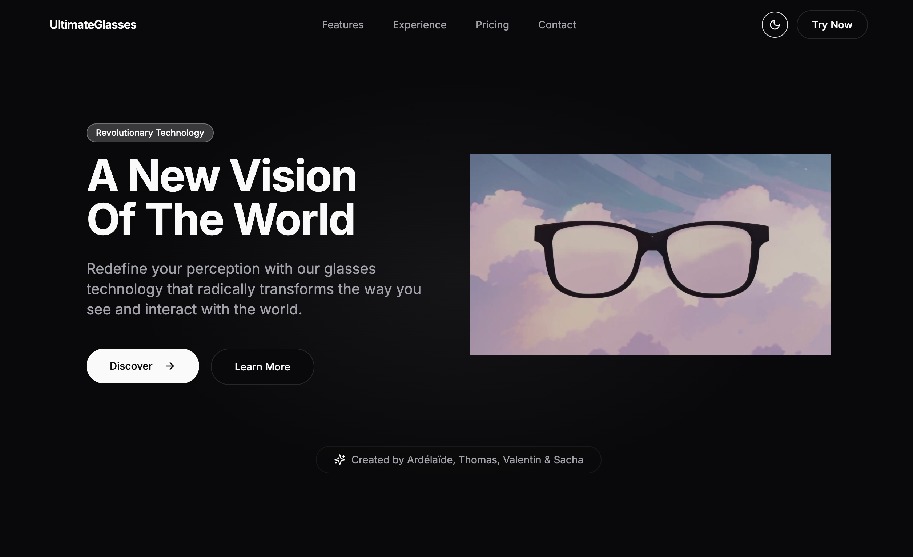

# UltimateGlasses - Projet d'Anglais

Ce projet a été créé dans le cadre d'un cours d'anglais où nous devions présenter un produit innovant qui n'existe pas encore. Nous avons choisi de créer une landing page pour "UltimateGlasses", une paire de lunettes révolutionnaire qui combine réalité augmentée, intelligence artificielle et technologies de pointe.

## 🎯 Objectif du Projet

L'objectif était de créer une présentation marketing convaincante en anglais pour un produit fictif, en utilisant les technologies web modernes. Nous avons développé une landing page interactive et responsive qui met en valeur les fonctionnalités innovantes d'UltimateGlasses.

## 🛠 Technologies Utilisées

- Next.js 15.2.4
- Tailwind CSS
- Lucide Icons
- TypeScript

## 📱 Aperçu du Site

### Page d'accueil


### Site complet


## 🌟 Fonctionnalités Principales

- Design moderne et responsive
- Thème sombre/clair
- Animations fluides
- Sections interactives
- Présentation des fonctionnalités du produit
- Témoignages
- Plans de tarification

## 👥 Équipe

- Ardélaïde
- Thomas
- Valentin
- Sacha

## 🚀 Installation

```bash
# Cloner le repository
git clone [url-du-repo]

# Installer les dépendances
npm install

# Lancer le serveur de développement
npm run dev
```

## 📝 Note

Ce projet est purement fictif et a été créé uniquement à des fins éducatives dans le cadre d'un cours d'anglais.

## Getting Started

First, run the development server:

```bash
npm run dev
# or
yarn dev
# or
pnpm dev
# or
bun dev
```

Open [http://localhost:3000](http://localhost:3000) with your browser to see the result.

You can start editing the page by modifying `app/page.tsx`. The page auto-updates as you edit the file.

This project uses [`next/font`](https://nextjs.org/docs/app/building-your-application/optimizing/fonts) to automatically optimize and load [Geist](https://vercel.com/font), a new font family for Vercel.

## Learn More

To learn more about Next.js, take a look at the following resources:

- [Next.js Documentation](https://nextjs.org/docs) - learn about Next.js features and API.
- [Learn Next.js](https://nextjs.org/learn) - an interactive Next.js tutorial.

You can check out [the Next.js GitHub repository](https://github.com/vercel/next.js) - your feedback and contributions are welcome!

## Deploy on Vercel

The easiest way to deploy your Next.js app is to use the [Vercel Platform](https://vercel.com/new?utm_medium=default-template&filter=next.js&utm_source=create-next-app&utm_campaign=create-next-app-readme) from the creators of Next.js.

Check out our [Next.js deployment documentation](https://nextjs.org/docs/app/building-your-application/deploying) for more details.
